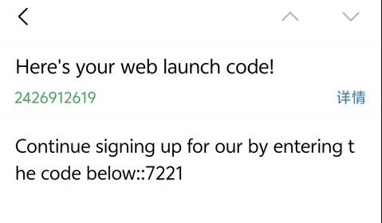

# Weibo-restaurantpay微博-餐结

微博团购,带动实体经济。Spring Boot + Vue 3 ,使用redis+nginx的分布式系统，提供用户认证、文章管理、分类管理、优惠券秒杀，微博团购，热点评论，团购支付，核心功能。由管理员，用户，商家三方组成。

------


# 后端说明


# 项目结构

```
weibo-comment/
├── backend-spring-weibo/                # 后端代码（Spring Boot 3 多模块）
│   ├── common/                          # 公共模块
│   │   └── src/main/java/common/
│   │       ├── constant/                # 常量定义（JWT、错误码、Redis前缀）
│   │       ├── exception/               # 全局异常处理
│   │       ├── properties/              # 配置属性（JWT、OSS、邮箱）
│   │       ├── result/                  # 统一响应封装（Result、ScrollResult）
│   │       └── util/                    # 工具类
│   │ 
│   ├── model/                           # 数据传输对象
│   │ 
│   ├── mapper/                          # 数据访问层 	
│   │ 
│   ├── service/                         # 业务逻辑模块	
│   │ 
│   └── start/                           # 启动模块
│       └── src/main/
│           ├── java/start/
│           │   ├── controller/          # REST控制器（各模块API入口）
│           │   ├── filter/              # JWT过滤器
│           │   ├── config/              # 配置类
│           │   ├── security/            # Spring Security安全相关
│           │   ├── aspect/              # 自定义切面
│           │   └── handler/             # 自动填充处理器
│           └── resources/
│               ├── application.yml      # 主配置文件
│               └── *.lua                # Redis Lua脚本
├── frontend-vue-weibo-adminer/                  # 前端代码(Vue 3)
├── frontend-vue-weibo-workerer/                 # 前端代码(Vue 3)
├── database-sql/                        # 数据库脚本目录
│   ├── sql.txt                          # 数据库初始化SQL
│   └── 数据库设计文档.md                  # 完整的数据库设计说明
└── 说明/                                 # 项目说明文档
    ├── 原型功能/                         # 前端原型截图
    ├── 并发测试结果/                      # 秒杀并发测试结果
    │   	├── 乐观锁解决超卖.png            	# 乐观锁方案测试截图
    │   	├── 分布式锁解决集群一人多单.png     # 分布式锁方案测试截图
    │  	    ├── 悲观锁集群不能一人一单.png      # 悲观锁方案测试截图
    │       ├── redis同步.png         # Redis同步测试截图
    │       ├── redis同步.txt         # Redis同步测试Slf4j日志
    │       ├── redis异步.png         # Redis异步（队列）测试截图
    │       ├── redis异步.txt         # Redis异步（队列）测试Slf4j日志
    │       ├── stream异步.png        # Redis Stream异步测试截图
    │       └── stream异步.txt        # Redis Stream异步测试Slf4j日志
    ├── nginx配置.txt                    # nginx配置.txt  
    ├── 高并发测试文档                     # 高并发测试文档
    └── 接口文档.md                       # 完整的API接口文档
```

# 环境要求

- JDK 17+
- Spring Boot 3+
- Node.js 20.19.0+ 或 22.12.0+
- MySQL 8.0+
- Redis 7.0+

## 一、用户管理模块

### 需求阶段

需求背景：项目需要一个完整的用户系统，支持注册、登录、信息修改、头像上传等基本功能。

- 传统Session认证在分布式环境下不好扩展
- 密码明文存储不安全
- 用户头像上传需要支持本地和云端（阿里云OSS）

### **策略流程图**

```java
用户注册 → UserController/register() → 加密密码 → MySQL保存用户 → 返回注册成功
用户登录 → UserController/login() → 校验用户名密码 → 生成JWT Token → Redis存储Token → 返回Token
请求拦截 → 直接拦截脚本等操作LoginInterceptor/对于活跃用户刷新ReLoginInterceptor → 校验Token → 滑动过期刷新 → 放行请求
```

### 编码阶段

```java
// SecurityConfig.java - 注册BCryptPasswordEncoder为Spring Bean
@Bean
public PasswordEncoder passwordEncoder() {
    return new BCryptPasswordEncoder();
}

// JwtRefreshFilter.java - 滑动过期Token刷新（Spring Security方案）
@Override
protected void doFilterInternal(HttpServletRequest request, HttpServletResponse response, FilterChain filterChain) {
    String token = extractToken(request);
    Map<String, Object> claims = JwtUtil.parseJWT(jwtProperties.getSecretKey(), token);
    Long userId = Long.parseLong(claims.get(JwtConstant.ID).toString());
    
    // 验证Token是否与Redis中存储的一致（防止Token被盗用）
    String standardToken = stringRedisTemplate.opsForValue().get("bigevent:" + userId);
    if (!token.equals(standardToken)) {
        response.setStatus(HttpServletResponse.SC_UNAUTHORIZED);
        return;
    }
    
    // 设置Spring Security认证上下文
    Authentication authentication = new UsernamePasswordAuthenticationToken(
        userId, token, Collections.singletonList(new SimpleGrantedAuthority("ROLE_USER")));
    SecurityContextHolder.getContext().setAuthentication(authentication);
    
    // 滑动过期：每次请求刷新Token有效期
    stringRedisTemplate.expire("bigevent:" + userId, jwtProperties.getTtlMillis(), TimeUnit.SECONDS);
    filterChain.doFilter(request, response);
}
```

### 问题修复阶段

Q：为什么jwt要用redis存储？

> | 维度         | 服务端 Session                | Redis                   |
> | ------------ | ----------------------------- | ----------------------- |
> | 部署架构     | 单体友好，集群麻烦            | 天生适配分布式、微服务  |
> | 存储位置     | 应用服务器内存                | 独立中间件 Redis        |
> | 客户端适配   | 依赖 Cookie，APP / 小程序难用 | Header 传输，全终端兼容 |
> | 服务重启影响 | 全部用户掉线                  | 不受影响                |
> | 强制下线     | 实现复杂                      | 直接删除 key，简单      |
> | 横向扩容     | 差                            | 优秀                    |
> | 跨域场景     | Cookie 跨域限制多             | 无 Cookie 限制          |

Q：账户的安全性，为啥放弃传统MD5加密?

>  1**面对AI与GPU海量算力，MD5算力防御几乎失效** 单张高端显卡每秒可完成上千亿次MD5哈希运算。攻击者借助AI生成智能字典、搭配GPU集群并行枚举，即便加盐，依然可以高速批量尝试口令。加盐只能抵御彩虹表，**无法降低单次哈希的运算速度**。 而BCrypt提供可调节的工作因子（Cost），人为拉长单次哈希耗时，大幅抬升攻击者算力成本。正常用户登录感知不到几十毫秒延迟，但会让暴力破解效率下降数十万倍。 2. **盐值管理存在工程风险** MD5+外置盐需要开发者手动实现盐生成、持久化、加密拼接逻辑，极易出现盐重复、盐长度不足等漏洞；BCrypt自动为每个用户生成独立随机盐，盐直接内嵌在密文字符串中，不需要额外设计数据库盐字段，由SpringSecurity原生封装，规避人为编码失误。

Q:Token过期时间固定，用户活跃时Token也会过期

> 实现滑动过期策略，在ReLoginInterceptor中每次请求时刷新Redis中Token的有效期

```java
// ReLoginInterceptor.java
@Override
public boolean preHandle(HttpServletRequest request, HttpServletResponse response, Object handler) throws Exception {
    String token = request.getHeader("Authorization");
    Map<String, Object> claims = JwtUtil.parseJWT(jwtProperties.getSecretKey(), token);
    String currentId = claims.get(JwtConstant.ID).toString();
    Long id = Long.parseLong(currentId);
    
    // 验证Token是否与Redis中存储的一致
    String standard_token = stringRedisTemplate.opsForValue().get("bigevent:" + id);
    if (!standard_token.equals(token)) {
        response.setStatus(HttpServletResponse.SC_UNAUTHORIZED);
        return false;
    }
    
    // 刷新Token有效期（滑动过期策略）
    stringRedisTemplate.expire("bigevent:" + id, jwtProperties.getTtlMillis(), TimeUnit.SECONDS);
    
    // 将用户信息存入ThreadLocalContextHolder
    ThreadLocalContextHolder.set(claims);
    return true;
}
```

---

## 二、文章管理模块

###  需求阶段

需求背景：需要支持文章的CRUD操作，文章量较大时需要缓存优化。

- 文章列表查询慢
- 热点文章访问压力大
- 缓存与数据库一致性问题

### **策略流程图**


```java
查询文章 → ArticleController → ArticleServiceImpl → Redis查询缓存
    ├─ 缓存存在且未过期 → 直接返回缓存数据
    ├─ 缓存存在但已过期 → RedisLock分布式锁 → 查询数据库 → 更新缓存 → 返回新数据
    └─ 缓存不存在 → 查询数据库 → 设置逻辑过期缓存 → 返回数据
更新文章 → ArticleController → ArticleServiceImpl → 更新MySQL → 删除Redis缓存
```

### 编码阶段

```java
// ArticleServiceImpl.java - 逻辑过期缓存查询（防止缓存击穿）
private Article logicCache(Long id) {
    String key = KEYS + id;
    String value = stringRedisTemplate.opsForValue().get(key);
    
    // 缓存不存在：查询数据库并设置逻辑过期
    if (StrUtil.isBlank(value)) {
        Article article = super.getById(id);
        RedisData redisData = new RedisData();
        if (article == null) {
            redisData.setData(null);
            redisData.setExpireTime(LocalDateTime.now().plusSeconds(30));
            stringRedisTemplate.opsForValue().set(key, JSONUtil.toJsonStr(redisData));
            throw new RuntimeException("id不存在");
        }
        redisData.setData(article);
        redisData.setExpireTime(LocalDateTime.now().plusSeconds(5)); // 逻辑过期时间
        stringRedisTemplate.opsForValue().set(key, JSONUtil.toJsonStr(redisData));
        return article;
    }
    
    // 缓存存在：检查是否过期
    RedisData redisData = JSONUtil.toBean(value, RedisData.class);
    if (redisData.getExpireTime().isBefore(LocalDateTime.now())) {
        // 过期：尝试获取分布式锁，只有一个线程更新缓存
        Boolean success = stringRedisTemplate.opsForValue()
            .setIfAbsent(LOCK_KEY, "locked", 5, TimeUnit.SECONDS);
        if (success) {
            try {
                Article article = super.getById(id);
                redisData.setExpireTime(LocalDateTime.now().plusSeconds(5));
                redisData.setData(article);
                stringRedisTemplate.opsForValue().set(key, JSONUtil.toJsonStr(redisData));
            } finally {
                stringRedisTemplate.delete(LOCK_KEY);
            }
        }
    }
    return BeanUtil.toBean(redisData.getData(), Article.class);
}
```

### 问题修复阶段

Q：为什么用逻辑过期而不是物理过期？

> A：物理过期的话，缓存过期瞬间会有大量请求穿透到数据库（缓存击穿）。逻辑过期是缓存永不过期，但在数据中记录过期时间，过期后通过分布式锁让一个线程去更新缓存，其他线程返回旧数据，这样不会导致数据库压力骤增。

Q：为什么不直接用@Cacheable注解？

> A：@Cacheable是Spring提供的声明式缓存，虽然方便但不够灵活。比如需要自定义缓存策略、分布式锁控制、逻辑过期等场景，手动控制Redis操作更合适。

Q: 缓存击穿问题 - 热点文章缓存过期瞬间，大量请求同时穿透到数据库

> 使用分布式锁（RedisLock）+ 逻辑过期策略

---

## 三、分类管理模块

### 需求阶段

需求背景：文章需要分类管理，支持分类的增删改查，分类数据相对稳定但访问频繁。

- 分类数量较少但查询频率高
- 需要与文章模块共享缓存策略
- 分类修改后需要及时同步到缓存

### **策略流程图**

```java
查询分类 → CategoryController → CategoryServiceImpl → Redis查询缓存
    ├─ 缓存存在且未过期 → 直接返回缓存数据
    ├─ 缓存存在但已过期 → RedisLock分布式锁 → 查询数据库 → 更新缓存 → 返回新数据
    └─ 缓存不存在 → 查询数据库 → 设置逻辑过期缓存 → 返回数据
更新分类 → CategoryController → CategoryServiceImpl → 更新MySQL → 删除Redis缓存
```

### 编码阶段

```java
// CategoryServiceImpl.java - 更新后主动删除缓存，保证数据一致性
@Override
public Boolean updateCache(Category category) {
    String key = KEYS + category.getId();
    boolean result = super.updateById(category);
    // 更新数据库后删除缓存，下次查询从数据库获取最新数据
    stringRedisTemplate.delete(key);
    return result;
}
```

### 问题修复阶段

Q：为什么复用文章模块的缓存策略？

> A：分类数据和文章数据的缓存需求相似——都是读多写少、需要防止缓存击穿。复用相同的逻辑过期+分布式锁策略可以减少代码重复，提高可维护性。

Q：分类和文章的缓存策略有什么差异？

> A：分类数据量更小（通常几十到几百个），缓存命中率更高，可以设置更长的逻辑过期时间。而文章数据量大，需要更频繁地更新缓存。

Q: 分类修改后，文章页面显示的分类名称没有更新

> 在分类更新/删除时主动删除缓存，确保下次查询时从数据库获取最新数据

```java
@Override
public Boolean updateCache(Category category) {
    String key = KEYS + category.getId();
    boolean result = super.updateById(category);
    stringRedisTemplate.delete(key);  // 删除缓存
    return result;
}
```

---

## 四、探店博文模块

### 需求阶段

需求背景：实现探店笔记功能，支持用户发布探店博文、点赞互动等社交功能。

- 点赞操作并发冲突问题
- 点赞状态需要实时查询
- 热点笔记点赞数统计压力大

### **策略流程图**

```java
点赞请求 → BlogController/likes() → 更新MySQL点赞数 → Redis ZSet记录点赞用户（score=timestamp）→ 返回结果
取消点赞 → BlogController/likes() → 更新MySQL点赞数 → Redis ZSet移除点赞用户 → 返回结果
查询点赞状态 → Redis ZSet/ZScore判断用户是否存在
查询热门点赞 → Redis ZSet/ZRange获取Top N用户ID → 查询用户信息 → 返回结果
```

### 编码阶段

```java
// BlogController.java - Redis ZSet实现点赞+收件箱滚动分页
@PostMapping("/liked/{id}")
public Result isliked(@PathVariable Long id) {
    Long userId = SecurityContextParam.getCurrentUserId();
    Double liked = stringRedisTemplate.opsForZSet().score(BLOG_LIKED_PREFIX + id, userId.toString());
    if (liked == null) {
        // 未点赞：原子操作MySQL+Redis
        blogService.lambdaUpdate().setSql("liked = liked + 1").eq(Blog::getId, id).update();
        stringRedisTemplate.opsForZSet().add(BLOG_LIKED_PREFIX + id, userId.toString(), System.currentTimeMillis());
    } else {
        // 已点赞：取消点赞
        blogService.lambdaUpdate().setSql("liked = liked - 1").eq(Blog::getId, id).update();
        stringRedisTemplate.opsForZSet().remove(BLOG_LIKED_PREFIX + id, userId.toString());
    }
    return Result.success();
}

// 收件箱滚动分页（基于时间戳的游标分页）
@GetMapping("/follow/of/all")
public Result follow(@RequestParam(required = false) Long max, Long offset) {
    if (max == null) max = System.currentTimeMillis();
    Long userId = SecurityContextParam.getCurrentUserId();
    Set<ZSetOperations.TypedTuple<String>> result = stringRedisTemplate.opsForZSet()
        .reverseRangeByScoreWithScores(BLOG_FOLLOW_PREFIX + userId, 0, max, offset, 10);
    // ...解析结果，构建ScrollResult返回
}
```

### 问题修复阶段

Q：为什么点赞用Redis的ZSet而不是普通Set？

> A：ZSet可以存储分数（timestamp），这样可以按点赞时间排序，方便获取热门点赞用户。同时ZSet的score操作是原子的，不会出现并发问题。

Q：为什么点赞数同时存Redis和MySQL？

> A：Redis用于实时查询和计数，MySQL用于持久化存储。点赞操作先更新MySQL再更新Redis，保证数据最终一致性。

Q:点赞操作在高并发下可能出现计数不准确

> MySQL使用原子操作 `setSql("liked= liked + 1")`，Redis使用ZSet的原子add/remove操作，保证计数一致性。

---

## 五、评论与回复模块

### 需求阶段

需求背景：实现评论功能，支持对探店笔记的评论和回复，支持多级回复。

- 评论数据量大，查询性能要求高
- 需要支持评论的点赞和举报功能
- 评论与回复的层级关系需要清晰

### **策略流程图**

```java
发表评论 → BlogCommentsController/save() → 设置parent_id=0 → MySQL保存 → 返回结果
回复评论 → BlogCommentsController/save() → 设置parent_id=1，answer_id=目标评论ID → MySQL保存 → 返回结果
查询评论列表 → BlogCommentsController/list() → MySQL按blog_id分页查询 → 返回评论列表（含回复）
点赞评论 → BlogCommentsController/likes() → MySQL更新点赞数 → 返回结果
```

### 编码阶段

```java
// BlogCommentsController.java - 多级回复实现
// parent_id=0 表示直接评论博文，parent_id=1 表示回复其他评论
// answer_id 记录回复目标评论ID，构建回复链
BlogComments blogComments = BeanUtil.toBean(blogCommentsDTO, BlogComments.class);
blogComments.setParentId(1L);           // 标记为回复
blogComments.setAnswerId(targetId);       // 设置回复目标评论ID
blogCommentsService.save(blogComments);
```

### 问题修复阶段

Q：为什么用parent_id区分评论和回复？

> A：`parent_id = 0` 表示直接评论博文，`parent_id = 1` 表示回复其他评论。这种设计可以支持无限层级的回复，同时查询时可以通过parent_id区分评论和回复。

Q：评论表为什么需要answer_id字段？

> A：`answer_id` 记录回复目标评论的ID，用于构建评论的回复链，方便前端展示回复关系。

Q：评论状态管理（正常、被举报、禁止查看）

> 修复方案：在blog_comments表中设置status字段，0表示正常，1表示被举报，2表示禁止查看。查询时过滤掉status=2的评论。

---

## 六、文件管理模块

### 需求阶段

需求背景：实现文件上传下载功能，支持本地存储和阿里云OSS云存储两种方式。

- 本地存储在多实例部署时文件不一致
- 大文件上传需要分片处理
- 文件访问需要URL映射

### **策略流程图**：

```java
文件上传（本地）→ FileController/upload() → UUID生成文件名 → 保存到本地目录 → 返回本地访问URL
文件上传（阿里云OSS）→ FileOssController/upload() → UUID生成文件名 → AliOssUtil上传 → 返回CDN访问URL
文件下载（本地）→ FileController/download() → 读取本地文件 → 设置Content-Disposition → 返回文件流
文件下载（阿里云OSS）→ FileOssController/download() → AliOssUtil下载 → 返回文件流
```

### 编码阶段

```java
// AliOssUtil.java - 阿里云OSS文件上传
public String uploadFile(String objectName, InputStream inputStream) {
    String endpoint = aliOssProperties.getEndpoint();
    String bucketName = aliOssProperties.getBucketName();
    OSS ossClient = new OSSClientBuilder().build(endpoint, accessKeyId, accessKeySecret);
    try {
        ossClient.putObject(bucketName, objectName, inputStream);
        // 返回CDN访问URL
        return "https://" + bucketName + "." + endpoint.substring(endpoint.lastIndexOf("/") + 1) + "/" + objectName;
    } finally {
        ossClient.shutdown();
    }
}
```

### 问题修复阶段

Q：为什么提供两种文件存储方式？

> A：本地存储用于开发测试环境，简单快捷；阿里云OSS用于生产环境，支持高可用和CDN加速。

Q：文件命名为什么用UUID？

> A：UUID全局唯一，避免文件名冲突，同时增加安全性（防止文件遍历攻击）。

Q：文件下载中文文件名乱码

修复方案：使用URLEncoder编码文件名，同时设置Content-Disposition响应头

```java
response.setHeader("Content-Disposition", "attachment;filename=" + 
    URLEncoder.encode(fileName, StandardCharsets.UTF_8));
```

---

## 七、优惠券与秒杀模块

### 需求阶段

需求背景：实现优惠券秒杀功能，支持高并发场景下的库存扣减和一人一单限制。

- 高并发下库存超卖问题
- 分布式环境下一人一单限制
- 锁竞争导致性能下降

### 秒杀策略流程图

#### 同步版本流程

```
用户请求 → 校验秒杀活动 → 生成订单ID → 直接调用secondKill() → 扣库存+保存订单 → 返回结果
```

#### 异步单机版本流程

```
用户请求 → 校验秒杀活动 → Lua脚本校验 → 放入ArrayBlockingQueue → 返回订单ID
                                                              ↓
                                        后台线程 take() → RedisLock → paySuccess() → 扣库存+保存订单
```

#### 异步分布式版本流程

```
用户请求 → 校验秒杀活动 → Lua脚本校验（自动XADD到Stream）→ 返回订单ID
                                                         ↓
                                XREADGROUP读取 → 解析订单 → secondKill() → 扣库存+保存订单 → ACK确认
```

#### 数据库操作阶段

无论是同步还是异步，最终都需要执行以下数据库操作：

1. **一人一单校验**：在事务中基于用户ID和优惠券ID查询已存在订单
2. **原子库存扣减**：使用 MyBatis Plus 的乐观锁 CAS 操作保证库存扣减的原子性
3. **订单创建**：保存订单记录

> **注意**：同步版本直接在请求线程中执行数据库操作，而异步版本在后台线程池中执行。

```
用户请求 → Lua脚本校验（库存+重复下单）→ 成功
								  ↓ →放入异步队列 → 后台线程处理（扣库存+保存订单）
                                  ↓ →失败→直接返回
```

### 编码阶段

**创建优惠券**

```java
@PostMapping("/create")
public Result createVoucher(@RequestBody VoucherDTO voucherDTO) {
    Voucher voucher = BeanUtil.toBean(voucherDTO, Voucher.class);
    voucherService.save(voucher);
    // 创建秒杀活动并初始化Redis库存
    List<VoucherSeckill> voucherSeckillList = voucherDTO.getVoucherSeckillList().stream()
            .map(vs -> VoucherSeckill.builder()
                    .stock(vs.getStock())
                    .beginTime(vs.getBeginTime())
                    .endTime(vs.getEndTime())
                    .voucherId(voucher.getId())
                    .build())
            .toList();
    // 将库存同步到Redis
    for (VoucherSeckill vs : voucherSeckillList) {
        stringRedisTemplate.opsForValue().set(
            "voucherSeckill:stock:" + voucher.getId(), 
            vs.getStock().toString());
    }
    voucherSeckillService.saveBatch(voucherSeckillList);
    return Result.success("createVoucher");
}
```

**Lua脚本（redis-seckill.lua）**：

```lua
-- 参数：优惠券ID、用户ID
local voucherId = ARGV[1]
local userId = ARGV[2]

-- Redis Key定义
local stockKey = "voucherSeckill:stock:" .. voucherId
local orderKey = "voucherSeckill:order:" .. voucherId

-- 1. 判断库存
if tonumber(redis.call('get', stockKey)) <= 0 then
    return 1  -- 库存不足
end

-- 2. 判断是否已下单
if redis.call('sismember', orderKey, userId) > 0 then
    return 2  -- 重复下单
end

-- 3. 扣减库存
redis.call('incrby', stockKey, -1)

-- 4. 记录下单用户
redis.call('sadd', orderKey, userId)

-- 5. 成功
return 0
```

#### VoucherSeckillController（同步版本）

```java
// VoucherSeckillController.java
@PostMapping("/pay")
public Result redisLock(@RequestBody VoucherOrder voucherOrder) {
    // 校验秒杀活动是否有效
    VoucherSeckill voucherSeckill = voucherSeckillService.voucherSeckillValid(voucherOrder.getVoucherId());
    if (voucherSeckill == null) {
        return Result.error("秒杀活动不存在或已结束");
    }
    
    // 获取当前用户ID，设置订单基础信息
    Long userId = ThreadLocalParam.getUserId();
    voucherOrder.setId(redisID.createId("orderId"));
    voucherOrder.setUserId(userId);
    voucherOrder.setStatus(1L);
    
    // 直接调用同步下单方法
    voucherOrderService.secondKill(voucherOrder);
    return Result.success("paySuccess");
}
```

**适用场景**：并发量较低的场景（单机几百QPS），实现简单，易于调试。

---

####  VoucherController（异步版本 - 单机版本流程）

```java
// VoucherController.java - 下单接口
@PostMapping("/pay")
public Result redisLock(@RequestBody VoucherOrder voucherOrder) {
    // 校验秒杀活动
    VoucherSeckill voucherSeckill = voucherSeckillService.voucherSeckillValid(voucherOrder.getVoucherId());
    if (voucherSeckill == null) {
        return Result.error("秒杀活动不存在或已结束");
    }
    
    Long userId = ThreadLocalParam.getUserId();
    Long orderId = redisID.createId("pay");
    
    // 执行Lua脚本：校验库存和重复下单
    Long result = stringRedisTemplate.execute(REDIS_SCRIPT,
            List.of(),
            voucherOrder.getVoucherId().toString(),
            userId.toString(),
            orderId.toString());
    
    if (result != 0) {
        return Result.error(result == 1 ? "库存不够" : "重复下单");
    }
    
    // 设置订单信息，放入内存队列异步处理
    voucherOrder.setId(orderId);
    voucherOrder.setUserId(userId);
    voucherOrder.setStatus(1L);
    boolean offer = orderQueue.offer(voucherOrder);
    if (!offer) {
        return Result.error("系统繁忙，请稍后重试");
    }
    return Result.success(orderId);
}

// 异步订单处理线程
private class HandleOrderTaskByList implements Runnable {
    @Override
    public void run() {
        while (true) {
            try {
                // 从队列中取出订单（阻塞等待）
                VoucherOrder voucherOrder = orderQueue.take();
                
                // 使用RedisLock分布式锁防止重复处理
                ILock redisLock = new RedisLock(stringRedisTemplate,
                        "redisson:voucherSeckill:" + voucherOrder.getUserId() + ":" + voucherOrder.getVoucherId());
                boolean locked = redisLock.getLocked(10);
                if (!locked) {
                    continue;
                }
                
                try {
                    // 执行实际的下单逻辑
                    voucherOrderService.paySuccess(voucherOrder);
                } finally {
                    redisLock.unlock();
                }
            } catch (Exception e) {
                Thread.currentThread().interrupt();
                log.error("订单处理线程异常: " + e.getMessage());
                break;
            }
        }
    }
}
```

**适用场景**：中等并发场景（单机几千QPS），内存队列速度快，但重启后队列数据会丢失。

---

#### VoucherOrderController（异步版本 - Redis Stream）

- 使用 Lua 脚本在 Redis 中完成库存校验和扣减
- 使用 **Redis Stream** 作为消息队列，支持消息持久化
- 使用消费组模式（Consumer Group），支持多实例部署
- 使用 Redisson 分布式锁防止重复处理

```java
// VoucherOrderController.java - 下单接口
@PostMapping("/pay")
public Result redisproLock(@RequestBody VoucherOrder voucherOrder) {
    // 校验秒杀活动
    VoucherSeckill voucherSeckill = voucherSeckillService.voucherSeckillValid(voucherOrder.getVoucherId());
    if (voucherSeckill == null) {
        return Result.error("秒杀活动不存在或已结束");
    }
    
    Long userId = ThreadLocalParam.getUserId();
    Long orderId = redisID.createId("order");
    
    // 执行Lua脚本：校验库存和重复下单
    Long result = stringRedisTemplate.execute(REDIS_SCRIPT,
            List.of(),
            voucherOrder.getVoucherId().toString(),
            userId.toString(),
            orderId.toString());
    
    if (result != 0) {
        return Result.error(result == 1 ? "库存不够" : "重复下单");
    }
    return Result.success(orderId);
}

// 异步订单处理线程（从Redis Stream读取）
private class HandleOrderTask implements Runnable {
    @Override
    public void run() {
        String streamKey = "stream.order";
        while (true) {
            // XREADGROUP GROUP g1 c1 COUNT 10 BLOCK 2000 STREAMS stream.order >
            List<MapRecord<String,Object,Object>> messageList = stringRedisTemplate.opsForStream().read(
                    Consumer.from("g1", "c1"),
                    StreamReadOptions.empty().count(10).block(Duration.ofSeconds(2)),
                    StreamOffset.create(streamKey, ReadOffset.lastConsumed()));
            
            if (messageList == null || messageList.isEmpty()) {
                continue;
            }
            
            // 解析订单信息
            MapRecord<String,Object,Object> record = messageList.get(0);
            Map<Object,Object> map = record.getValue();
            VoucherOrder voucherOrder = VoucherOrder.builder()
                    .voucherId(Long.parseLong(map.get("voucherId").toString()))
                    .userId(Long.parseLong(map.get("userId").toString()))
                    .id(Long.parseLong(map.get("orderId").toString()))
                    .build();
            
            // 执行下单逻辑
            voucherOrderService.secondKill(voucherOrder);
            
            // 确认消息已处理
            stringRedisTemplate.opsForStream().acknowledge(streamKey, "g1", record.getId());
        }
    }
}
```

**适用场景**：高并发场景（单机几万QPS），消息持久化，支持多实例部署，故障恢复能力强。

###  问题修复阶段

Q：库存超卖

修复方案：Redis中用Lua脚本原子扣减,MySQL中用乐观锁 `gt(stock, 0).setSql("stock = stock - 1")`

Q：重复下单

修复方案：Redis中用Set存储已下单用户ID（sismember判断）,MySQL中查询已有订单记录

Q：分布式锁误删

修复方案：使用Lua脚本释放锁，只有锁的持有者才能释放

Q：为什么用Redis做秒杀而不是直接操作数据库？

> A：数据库的处理能力有限（MySQL单机约1000 QPS），而Redis可以轻松处理10万+ QPS。先在Redis中完成库存扣减和订单校验，再异步写入数据库，这样可以扛住瞬时流量。

Q：为什么用Lua脚本？

> A：Lua脚本可以保证多个Redis命令的原子性执行，避免竞态条件。比如扣库存和判断一人一单必须同时成功或同时失败。

Q：为什么要异步处理订单？

> A：如果同步处理，用户下单请求需要等待数据库操作完成，响应时间长。异步处理可以先返回订单ID，后台线程慢慢处理数据库写入，提升用户体验。

Q: 为什么从同步版演进到异步版？

> A：同步版本在高并发下会导致数据库压力过大，响应时间变长。异步版本将热点操作转移到Redis，数据库操作异步化，大大提升了系统的吞吐量和响应速度。

Q: 为什么从内存队列演进到Redis Stream？

> A：内存队列在应用重启后数据会丢失，且不支持多实例部署。Redis Stream提供消息持久化和消费组机制，适合生产环境的高可用部署。

### 三种架构对比

| 维度 | VoucherSeckillController | VoucherController | VoucherOrderController |
| :--- | :--- | :--- | :--- |
| **处理方式** | 同步 | 异步（jvm队列） | 异步（Redis Stream） |
| **队列类型** | 无 | ArrayBlockingQueue | Redis Stream |
| **分布式锁** | Redisson | 自定义RedisLock | Redisson |
| **消息持久化** | 无 | 无 | 有 |
| **多实例支持** | 支持（锁保证） | 不支持（内存队列） | 支持（消费组） |
| **吞吐量** | 低（几百QPS） | 中（几千QPS） | 高（几万QPS） |
| **故障恢复** | 无状态 | 队列数据丢失 | 消息可恢复 |
| **适用场景** | 测试/低并发 | 中等并发 | 生产高并发 |

---

## 八、邮箱登录与验证码模块


### 需求阶段

需求背景：实现邮箱验证码登录功能，支持用户通过邮箱接收验证码进行身份验证登录。

- 验证码发送需要异步处理，避免阻塞用户请求
- 验证码需要设置有效期，过期后失效
- 高并发场景下邮件发送需要削峰填谷

### **策略流程图**：

```java
发送验证码 → LoginController/sendCode() → 生成6位验证码 → Redis存储（10分钟过期）→ XADD到Redis Stream → 返回结果
                                               ↓
                                       后台线程 XREADGROUP读取 → JavaMailSender发送邮件 → ACK确认
邮箱登录 → LoginController/loginByEmail() → Redis校验验证码 → 查询用户 → 生成JWT Token → 返回Token
```

### 编码阶段

```java
// LoginController.java - Redis Stream异步发送验证码邮件
@PostMapping("/code")
public Result sendCode(@Email String email) {
    String code = RandomUtil.randomString(4);
    // Redis存储验证码（10分钟过期）
    stringRedisTemplate.opsForValue().set("code:" + email, code, 10, TimeUnit.MINUTES);
    // XADD到Redis Stream，异步发送邮件（请求立即返回）
    stringRedisTemplate.opsForStream().add(CODE_STREAM, Map.of("code", code, "email", email));
   return Result.success("10分钟内有效");
}

// 后台线程从Stream读取消息并发送邮件
private class HandleCodeTask implements Runnable {
    @Override
    public void run() {
        List<MapRecord<String,Object,Object>> messageList = stringRedisTemplate.opsForStream().read(
            Consumer.from(CODE_STREAM_GROUP, UUID.randomUUID().toString()),
            StreamReadOptions.empty().count(1).block(Duration.ofSeconds(10)),
            StreamOffset.create(CODE_STREAM, ReadOffset.lastConsumed()));
        // 解析消息，发送邮件，ACK确认
        userService.sendEmail(email, "验证码", "您的验证码是：" + code);
        stringRedisTemplate.opsForStream().acknowledge(CODE_STREAM, CODE_STREAM_GROUP, record.getId());
    }
}
```

### 问题修复阶段

Q：为什么用Redis Stream异步发送邮件？

> A：邮件发送是IO密集型操作，直接在请求线程中发送会导致响应时间过长。使用Redis Stream作为消息队列，可以实现异步解耦，请求线程只负责生成验证码并存入队列，后台线程负责实际发送邮件。

Q：为什么验证码存在Redis而不是数据库？

> A：验证码是短期临时数据（10分钟过期），存入Redis可以利用其过期自动清理的特性，无需额外维护清理任务，且读写性能更高。

Q：Stream消费组重复创建异常

> 修复方案：在 `@PostConstruct` 初始化方法中捕获异常，若消费组已存在则忽略错误

```java
@PostConstruct
public void init() {
    try {
        stringRedisTemplate.opsForStream().createGroup(STREAM_KEY, "g1");
        log.info("Redis Stream消费组创建成功");
    } catch (Exception e) {
         //重复测试group会重复创建，有异常
        log.info("消费组已存在，跳过创建");
    }
    CODE_EXECUTOR.submit(new HandleCodeTask());
}
```

Q：应用关闭时线程池未正确关闭

> 修复方案：在 `@PreDestroy` 方法中优雅关闭线程池

```java
@PreDestroy
public void destroy() {
    CODE_EXECUTOR.shutdown();
    try {
        if (!CODE_EXECUTOR.awaitTermination(10, TimeUnit.SECONDS)) {
            CODE_EXECUTOR.shutdownNow();
        }
    } catch (InterruptedException e) {
        CODE_EXECUTOR.shutdownNow();
        Thread.currentThread().interrupt();
    }
}
```

---

## 九、关注管理模块

### 需求阶段

需求背景：实现用户之间的关注/取关功能，支持查询关注状态和共同关注的用户。

- 关注关系需要实时查询
- 共同关注用户查询需要高效的集合交集运算
- 关注操作需要同时更新数据库和缓存

### **策略流程图**

```java
关注请求 → UseFollowController/useFollow() → MySQL保存关注关系 → Redis Set添加（follow:{userId}）→ 返回结果
取关请求 → UseFollowController/useFollow() → MySQL删除关注关系 → Redis Set移除（follow:{userId}）→ 返回结果
查询关注状态 → UseFollowController/getUserFollow() → Redis Set/IsMember判断 → 返回结果
查询共同关注 → UseFollowController/getUserFollowCommon() → Redis Set/ZIntersect → 查询用户信息 → 返回结果
```

### 编码阶段

```java
// UseFollowController.java - Redis Set交集实现共同关注（O(1)复杂度）
@GetMapping("/common/{id}")
public Result getUserFollowCommon(@PathVariable("id") Long followId) {
    Long userId = SecurityContextParam.getCurrentUserId();
    // Redis Set intersect：高效计算两个用户关注集合的交集
    Set<String> commonSet = stringRedisTemplate.opsForSet()
        .intersect(FOLLOW_PREFIX + followId, FOLLOW_PREFIX + userId);
    if (CollectionUtil.isEmpty(commonSet)) return Result.success(null);
    List<Long> ids = commonSet.stream().map(Long::parseLong).toList();
    List<User> userList = userService.listByIds(ids);
    return Result.success(userList);
}
```

### 问题修复阶段

Q：为什么用Redis Set存储关注关系？

> A：Set支持高效的集合操作（add、remove、contains、intersect），非常适合实现关注关系的管理。共同关注功能可以通过Set的intersect操作快速获取两个用户关注集合的交集。

Q：为什么同时更新数据库和Redis？

> A：数据库用于持久化存储，保证数据不丢失；Redis用于高性能查询，提高关注状态查询和共同关注计算的响应速度。采用双写策略，先写数据库再写Redis。

Q：关注状态返回不够直观 ✅ 已修复

> 修复方案：返回更明确的状态描述（"已关注"/"未关注"），已在 `UseFollowController.java` 中应用

```java
// 将用户ID转换为用户信息列表
 List<Long> ids = commonSet.stream().map(s -> Long.parseLong(s)).toList();
//降低负载，ids = 一次
 List<User> userList = userService.listByIds(ids);
```

---

## 十、签到管理模块

### 需求阶段

需求背景：实现用户签到功能，支持每日签到、补签和签到统计，激励用户活跃。

- 签到记录数据量大，按月存储需要高效的存储空间
- 签到状态需要快速查询和统计
- 补签功能需要支持指定日期签到

**Redis Key设计**：

```
sign:{userId}:{yyyy-MM}  // 用户签到位图Key，例如 sign:1:2024-01
```

### 策略流程图

```java
签到请求 → SignController/createSign() → Redis SetBit设置签到位（offset=日期天数）→ 返回结果
补签请求 → SignController/backSign() → Redis SetBit设置指定日期签到位 → 返回结果
统计请求 → SignController/CountSign() → Redis BitField获取位图 → 统计1的个数 → 返回签到/缺勤数
保存请求（按月保存） → SignController/CountSign() → Redis BitField获取位图 → MySQL保存统计数据
```

### 编码阶段

```java
// SignController.java - Redis BitMap高效存储签到记录
// 每个用户每天的签到状态只需1个位（0或1），一个月最多31天≈4字节
@PostMapping("/count/day")
public Result countSign() {
    String key = SIGN_DATE + userId + ":" + now.format(DateTimeFormatter.ofPattern("yyyy-MM"));
    // bitfield key get u8 0：批量获取位图数据
    List<Long> result = stringRedisTemplate.opsForValue().bitField(key,
        BitFieldSubCommands.create()
            .get(BitFieldSubCommands.BitFieldType.unsigned(now.getDayOfMonth()))
            .valueAt(0));
    Long num10 = result.get(0);
    long signedDays = Long.bitCount(num10);  // 统计二进制中1的个数
    long unSignedDays = now.getDayOfMonth() - signedDays;
    return Result.success("签到::" + signedDays + ",缺勤::" + unSignedDays);
}
```

### 问题修复阶段

Q：为什么用Redis BitMap存储签到记录？

> A：BitMap（位图）是一种高效的位存储结构，每个用户每天的签到状态只需要1个位（0或1）。一个月最多31天，只需要31个位（约4字节）就能存储一个用户一个月的签到记录，极大节省存储空间。

Q：为什么用bitField命令统计签到次数？

> A：bitField可以批量获取位图中的位数据，将指定位数的二进制数据转换为十进制数，然后通过统计二进制中1的个数来快速计算签到天数。
>
> ```
> 第一种long signedDays = Long.bitCount(num10);
> 第二种for (int i = 0; i < now.getDayOfMonth(); i++){
>          if ((num10 & 1) == 1){
>              signedDays++;
>          }
>          num10 = num10 >>>1;
>      }
> ```

Q：签到统计时，如果当月没有任何签到记录，result为空导致空指针异常 ✅ 已修复

> 修复方案：使用 `CollectionUtil.isEmpty()` 判断结果是否为空，为空时返回0

```java
if (CollectionUtil.isEmpty(result)) {
    return Result.success(0);
}
```

Q：补签接口未校验日期是否合法（如日期格式错误、日期超出当月范围）

> 修复方案：在补签接口中添加日期格式校验和范围校验，防止非法日期操作

---

## 十一、店铺管理模块

### 需求阶段

需求背景：实现店铺管理功能，支持创建店铺和基于分类/地理位置查询附近店铺，为用户提供探店搜索服务。

- 店铺查询需要支持按距离排序，传统数据库查询效率低
- 店铺数据量较大，分页查询需要高效的游标策略
- 店铺分类与位置信息需要关联存储，便于快速检索

### **策略流程图**

```java
创建店铺 → ShopController/createShop() → MySQL保存Shop和ShopType → Redis GEO存储位置（shopType:{typeId}）→ 返回结果
查询店铺列表 → ShopController/ofType()
    ├─ 无经纬度 → MySQL游标分页查询（按ID升序，每页5条）→ 返回结果
    └─ 有经纬度 → Redis GEO搜索（5公里范围，按距离排序）→ 获取店铺ID列表 → MySQL查询详情 → 返回结果
```

### 编码阶段

```java
// ShopController.java - Redis GEO实现附近店铺搜索
@GetMapping("/of/type")
public Result ofType(@RequestParam Long typeId, @RequestParam(required = false) Double x, @RequestParam(required = false) Double y) {
    // 有经纬度：Redis GEO按距离排序查询5公里内的店铺
    GeoResults<RedisGeoCommands.GeoLocation<String>> results = stringRedisTemplate.opsForGeo().search(
        SHOP_TYPE + typeId,
        GeoReference.fromCoordinate(x, y),
        new Distance(5, Metrics.KILOMETERS),
        RedisGeoCommands.GeoSearchCommandArgs.newGeoSearchArgs()
            .includeDistance().limit(5).sortAscending());
    // 提取店铺ID列表，按距离排序返回
    List<String> nearbyShopIds = results.getContent().stream()
        .map(item -> item.getContent().getName()).toList();
    return Result.success(shopService.listByIds(nearbyShopIds));
}
```

### 问题修复阶段

Q：为什么用Redis GEO存储店铺位置？

> A：Redis GEO是专门为地理位置数据设计的数据结构，支持高效的距离计算和范围查询。使用GEO可以快速找到指定坐标附近的店铺，并且按距离排序，这是传统数据库难以实现的。

Q：为什么设计两种查询模式？

> A：当用户未提供位置信息时，使用基于ID的游标分页（滚动分页），简单高效；当用户提供经纬度时，使用Redis GEO按距离排序查询附近店铺，满足LBS（位置服务）需求。

Q：Redis GEO搜索结果为空时可能导致空指针异常

> 修复方案：使用 `CollectionUtil.isEmpty()` 判断结果是否为空，为空时直接返回空列表

```java
if (CollectionUtil.isEmpty(results)){
    return Result.success(null);
}
```

---

# 核心组件设计

### 1. Redis分布式ID生成器（RedisID）

```java
@Component
public class RedisID {
    // 基准时间：2020-01-01 00:00:00 UTC
    private final static long BEGIN_TIME = 1577836800L;
    // 32位序号最大值
    private static final long MAX_SEQ = 0xFFFFFFFFL;

    public long createId(String prefix) {
        long nowSeconds = ZonedDateTime.now(ZoneOffset.UTC).toEpochSecond();
        long timestamp = nowSeconds - BEGIN_TIME;
        
        String date = ZonedDateTime.now(ZoneOffset.UTC)
            .format(DateTimeFormatter.ofPattern("yyyy:MM:dd"));
        String key = "icr:" + prefix + ":" + date;
        long count = stringRedisTemplate.opsForValue().increment(key);
        
        return timestamp << 32 | count;
    }
}
```

Q：为什么不用UUID？

> A：UUID是随机字符串，无序，作为数据库主键会导致索引分裂，影响性能。而且UUID太长（36位），存储和传输成本高。

Q：为什么不用数据库自增ID？

> A：数据库自增ID在分布式环境下需要额外处理（比如分库分表），而且生成ID需要访问数据库，性能不如Redis。

Q：ID结构为什么是 1位符号位+时间戳(31位) + 序号(32位)？

> A：0作为符号位，正数自增，31位时间戳可以表示约68年（2^31秒 ≈ 68年），从2020年开始够用。32位序号可以表示约42亿，足够单日并发使用

# 依赖说明

### 用户管理功能依赖
| 依赖 | 版本 | 功能支撑 |
| :--- | :--- | :--- |
| Spring Boot | 3.3.8 | 应用框架，自动配置数据源、Redis等基础设施 |
| Spring Boot Starter Web | 3.3.8 | UserController提供REST接口（注册、登录、信息修改、头像上传、密码修改）；注册LoginInterceptor和ReLoginInterceptor拦截器校验登录状态 |
| Spring Boot Starter Security | 3.3.8 | SecurityConfig注册PasswordEncoder Bean供全局注入使用；matches()方法验证密码，而非解密 |
| MyBatis Plus | 3.5.9 | UserMapper继承BaseMapper实现用户数据CRUD；AutoMetaObjectHandler自动填充create_time、update_time等元数据字段 |
| JJWT API/Impl/Jackson | 0.12.6 | JwtUtil生成登录Token，ReLoginInterceptor验证Token并实现滑动过期策略（每次请求刷新Redis中Token有效期） |
| Spring Boot Starter Data Redis | 3.3.8 | 存储用户Token（`bigevent:{userId}`）和邮箱验证码（`code:{email}`，10分钟过期） |
| Spring Boot Starter Validation | 3.3.8 | @NotNull、@Size等注解校验注册和登录参数的合法性 |
| Aliyun SDK OSS | 3.17.4 | AliOssUtil实现用户头像上传到阿里云OSS，返回CDN访问URL |

### 事件文章管理功能依赖
| 依赖 | 版本 | 功能支撑 |
| :--- | :--- | :--- |
| MyBatis Plus | 3.5.9 | ArticleMapper实现文章数据CRUD；AutoMetaObjectHandler自动填充创建人ID和时间 |
| Spring Boot Starter Data Redis | 3.3.8 | **缓存策略**：ArticleServiceImpl使用分布式锁（`setIfAbsent`）5秒+逻辑过期（RedisData包装类），防止缓存击穿30秒；文章数据缓存**30分钟 - 2小时**（逻辑过期）本文选择**30分钟**负载平衡；更新/删除后主动删除缓存保证一致性 |
| Spring Boot Starter Validation | 3.3.8 | 自定义@ArticleStatus注解校验文章状态只能为"已发布"或"草稿" |
| Aliyun SDK OSS | 3.17.4 | 文章封面图片上传到阿里云OSS |
| Hutool All | 5.8.36 | BeanUtil进行缓存数据对象转换；StrUtil判空；JSONUtil序列化/反序列化Redis数据 |

### 分类管理功能依赖
| 依赖 | 版本 | 功能支撑 |
| :--- | :--- | :--- |
| MyBatis Plus | 3.5.9 | CategoryMapper实现分类数据CRUD；AutoMetaObjectHandler自动填充创建人ID和时间 |
| Spring Boot Starter Data Redis | 3.3.8 | **缓存策略**：CategoryServiceImpl使用分布式锁5秒+逻辑过期，防止缓存击穿30秒；分类数据缓存**10分钟 - 30分钟**（逻辑过期），本文选择**30分钟****负载平衡；更新/删除后主动删除缓存 |
| Spring Boot Starter Validation | 3.3.8 | @NotNull、@Size等注解校验分类名称和别名参数 |
| Hutool All | 5.8.36 | BeanUtil进行对象属性拷贝；StrUtil判空；JSONUtil序列化/反序列化 |

### 优惠券管理功能依赖
| 依赖 | 版本 | 功能支撑 |
| :--- | :--- | :--- |
| MyBatis Plus | 3.5.9 | VoucherMapper、VoucherSeckillMapper、VoucherOrderMapper实现优惠券数据CRUD；AutoMetaObjectHandler自动填充create_time、update_time等元数据字段 |
| Spring Boot Starter Data Redis | 3.3.8 | **分布式ID生成**：RedisID类基于Redis自增计数器实现全局唯一订单ID（0作为符号位+时间戳31位+序号32位）；存储秒杀库存信息；**分布式锁**：RedisLock基于setIfAbsent实现锁获取，Lua脚本原子释放 |
| Spring Boot Starter Validation | 3.3.8 | 参数校验支持 |
| Spring Boot Starter Web | 3.3.8 | 提供@Transactional注解实现秒杀订单事务一致性（通过spring-tx传递依赖） |
| Hutool All | 5.8.36 | BeanUtil进行对象属性拷贝（VoucherDTO转Voucher）；UUID生成分布式锁唯一标识 |

### 探店博文功能依赖
| 依赖 | 版本 | 功能支撑 |
| :--- | :--- | :--- |
| MyBatis Plus | 3.5.9 | BlogMapper实现探店博文数据CRUD；AutoMetaObjectHandler自动填充create_time、update_time等元数据字段 |
| Spring Boot Starter Data Redis | 3.3.8 | **点赞功能**：使用Redis ZSet存储点赞用户ID和时间戳，支持原子操作；实时查询点赞状态和热门点赞用户 |
| Hutool All | 5.8.36 | BeanUtil进行对象属性拷贝（BlogDTO转Blog）；BooleanUtil判断布尔值 |

### 评论与回复功能依赖
| 依赖 | 版本 | 功能支撑 |
| :--- | :--- | :--- |
| MyBatis Plus | 3.5.9 | BlogCommentsMapper实现评论数据CRUD；支持多级回复查询（parent_id、answer_id） |
| Spring Boot Starter Data Redis | 3.3.8 | 评论点赞功能支持；评论列表缓存 |

### 文件管理功能依赖
| 依赖 | 版本 | 功能支撑 |
| :--- | :--- | :--- |
| Spring Boot Starter Web | 3.3.8 | MultipartFile文件上传支持；文件下载响应流处理 |
| Aliyun SDK OSS | 3.17.4 | AliOssUtil实现文件上传到阿里云OSS，支持CDN加速访问 |

### 邮箱登录与验证码功能依赖
| 依赖 | 版本 | 功能支撑 |
| :--- | :--- | :--- |
| Spring Boot Starter Mail | 3.3.8 | JavaMailSender实现邮件发送功能，支持SMTP协议 |
| Spring Boot Starter Data Redis | 3.3.8 | **Redis Stream**：异步发送验证码消息队列（`valid:code:stream`），消费组模式支持多实例部署；存储验证码（`code:{email}`，10分钟过期）和登录Token（`bigevent:{userId}`） |
| JJWT API/Impl/Jackson | 0.12.6 | JwtUtil生成邮箱登录Token，支持自定义载荷和过期时间 |
| Spring Boot Starter Validation | 3.3.8 | @Email注解校验邮箱格式合法性 |

### 关注管理功能依赖
| 依赖 | 版本 | 功能支撑 |
| :--- | :--- | :--- |
| MyBatis Plus | 3.5.9 | UserFollowMapper实现关注关系数据CRUD；UserMapper查询用户信息 |
| Spring Boot Starter Data Redis | 3.3.8 | **Redis Set**：存储用户关注列表（`follow:{userId}`），支持add/remove/intersect操作；共同关注通过Set交集运算高效计算 |
| Hutool All | 5.8.36 | BooleanUtil判断关注状态布尔值 |

### 签到管理功能依赖
| 依赖 | 版本 | 功能支撑 |
| :--- | :--- | :--- |
| Spring Boot Starter Data Redis | 3.3.8 | **Redis BitMap**：存储用户签到位图（`sign:{userId}:{yyyy-MM}`），使用SetBit设置签到位，BitField批量获取位数据；每个用户每月仅需约4字节存储 |
| Hutool All | 5.8.36 | CollectionUtil判断签到统计结果是否为空；BeanUtil对象属性拷贝 |

### 店铺管理功能依赖
| 依赖 | 版本 | 功能支撑 |
| :--- | :--- | :--- |
| MyBatis Plus | 3.5.9 | ShopMapper、ShopTypeMapper实现店铺和分类数据CRUD；AutoMetaObjectHandler自动填充create_time、update_time等元数据字段 |
| Spring Boot Starter Data Redis | 3.3.8 | **Redis GEO**：存储店铺位置信息（`shopType:{typeId}`），支持按坐标搜索附近店铺，5公里范围内按距离排序；GeoSearch命令实现高效的LBS查询 |
| Hutool All | 5.8.36 | BeanUtil进行对象属性拷贝（ShopDTO转Shop/ShopType）；CollectionUtil判断GEO搜索结果是否为空 |

---

### 秒杀功能依赖

| 依赖 | 版本 | 功能支撑 |
| :--- | :--- | :--- |
| MyBatis Plus | 3.5.9 | VoucherMapper、VoucherSeckillMapper、VoucherOrderMapper实现优惠券数据CRUD；@Transactional注解实现事务一致性 |
| Spring Boot Starter Data Redis | 3.3.8 | **Lua脚本**：原子性校验库存和重复下单；**Redis Stream**：异步订单消息队列（消费组模式支持多实例部署）；**分布式ID生成**：RedisID类生成全局唯一订单ID |
| Spring Boot Starter Web | 3.3.8 | VoucherSeckillController、VoucherController、VoucherOrderController提供三种秒杀接口 |
| Spring Boot Starter Validation | 3.3.8 | 参数校验支持 |
| Hutool All | 5.8.36 | BeanUtil对象属性拷贝（VoucherDTO转Voucher）；UUID生成分布式锁唯一标识 |
| Redisson | 3.37.0 | 分布式锁实现一人一单限制；Watchdog自动续期防止锁过期 |

---

### 对比分析

**问题1：直接在Controller层用synchronized**

```java
// 其他人写法 - 错误！
@RequestMapping("/seckill")
public synchronized Result seckill(Long voucherId) {
    // 扣库存逻辑...
}
```
> 本项目改进：synchronized只在单实例有效，集群环境下必须用Redis分布式锁。

**问题2：不校验锁的持有者就释放**

```java
// 其他人写法 - 错误！
public void unlock() {
    stringRedisTemplate.delete(key);  // 可能删除其他线程的锁
}
```
> 本项目改进：用Lua脚本校验锁的value，只有持有者才能释放。

**问题3：同步处理订单**

```java
// 其他人写法 - 性能差！
@RequestMapping("/seckill")
public Result seckill(Long voucherId) {
    // 同步扣库存...
    // 同步保存订单...
    return Result.success();
}
```
> 本项目改进：先用Lua脚本在Redis中完成校验，再放入异步队列，后台线程处理数据库写入。

---

# 前端功能演示

| 登录页面       |     |
| -------------- | ----------------------------------- |
| 分类管理       |     |
| 文章列表       |     |
| hot查看        |     |
| 用户设置       |     |
| 用户信息       |     |
| 用户密码       |     |
| 邮箱发送验证码 |  |

------

